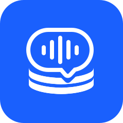

<div align="center">



# TalkBase

**녹음된 대화를 업무 지식으로 바꾸다**

회의 녹음 파일을 업로드하면 AI가 자동으로 STT · 화자분리 · 회의록 작성 · 요약 · 보고서까지 만들어주는 팀용 웹앱

[🌐 talkbase-navy.vercel.app](https://talkbase-navy.vercel.app) · [📋 PRD](./PRD.md) · [🐛 이슈](https://github.com/minsung6333/talkbase/issues)


</div>

---

## ✨ 주요 기능

### 🎙 녹음 처리
- 갤럭시 등 m4a / mp3 / wav 파일 업로드 (최대 **2GB, 4시간**)
- 리턴제로 RTZR STT — **한국어 CER 5.91% (국내 1위)**
- 자동 화자 분리 (최대 10인) + 화자 이름 매핑

### ✨ AI 정리
- GPT 기반 **회의록** 또는 **요약** 자동 생성
- 직접 편집 · AI 편집 · 빠른 액션 · 재생성
- **보고용 메일 모드** — 격식체로 자동 변환 (수신자별 톤 조절)

### 📂 지식 관리
- Google Drive 스타일 폴더 (팀 공유 / 개인 공간)
- 통합 검색 (제목 · STT 전문 · AI 결과물)
- 타임스탬프 클릭 → 해당 구간 오디오 재생

### 🔗 외부 연동
- Notion 페이지 자동 생성
- 네이버 웍스 SMTP 이메일 발송 (수신 이메일 별도 설정 가능)
- **읽기 전용 공유 링크** + OS 네이티브 공유 시트
- PWA 지원 — 홈 화면 설치 후 앱처럼 사용

### 👥 팀 관리
- Google OAuth 로그인 + 초대 메일 자동 발송
- 어드민 권한 분리
- 비로그인 사용자 사용 요청 폼

---

## 🏗 아키텍처

```
┌─────────────┐
│   브라우저   │ ─── PWA (Next.js App Router)
└──────┬──────┘
       │
       ├── 파일 업로드 (Presigned URL, R2 직접 업로드)
       ├── OAuth 로그인 (Supabase Auth → Google)
       │
       ▼
┌────────────────────────────────────┐
│   Next.js API Routes (Vercel ICN1)  │
│                                    │
│   - STT 요청 (리턴제로 RTZR)         │
│   - GPT 호출 (회의록/요약/보고서)    │
│   - Notion API (페이지 생성)        │
│   - SMTP (네이버 웍스 이메일)        │
└──────┬─────────────────────────────┘
       │
       ▼
┌─────────────┬──────────────┬─────────────┐
│  Supabase   │ Cloudflare R2 │  External   │
│  Postgres   │  m4a 파일      │   APIs      │
│  Auth       │  타임스탬프    │             │
│  RLS        │  스트리밍      │             │
└─────────────┴──────────────┴─────────────┘
```

---

## 🛠 기술 스택

| 영역 | 기술 |
|------|------|
| **프론트엔드** | Next.js 16 (App Router) · TypeScript · TailwindCSS 4 |
| **인증/DB** | Supabase (PostgreSQL + Auth + RLS) |
| **파일 저장소** | Cloudflare R2 (S3 호환, Presigned URL) |
| **STT** | 리턴제로 RTZR (Sommers 모델 · 한국어 특화) |
| **AI** | OpenAI GPT-4o |
| **이메일** | 네이버 웍스 SMTP (Nodemailer) |
| **외부 연동** | Notion API · OG Image (next/og) · PWA |
| **배포** | Vercel (서울 icn1 리전) |

---

## 🚀 빠른 시작

### 1. 저장소 클론

```bash
git clone https://github.com/minsung6333/talkbase.git
cd talkbase
npm install
```

### 2. 환경 변수 설정

`.env.local` 파일을 만들고 아래 값들을 채워주세요.

```env
# App
NEXT_PUBLIC_APP_URL=http://localhost:3000

# Supabase (https://supabase.com)
NEXT_PUBLIC_SUPABASE_URL=
NEXT_PUBLIC_SUPABASE_ANON_KEY=
SUPABASE_SERVICE_ROLE_KEY=

# Cloudflare R2 (https://dash.cloudflare.com)
R2_ACCOUNT_ID=
R2_ACCESS_KEY_ID=
R2_SECRET_ACCESS_KEY=
R2_BUCKET_NAME=

# 리턴제로 RTZR (https://developers.rtzr.ai)
RTZR_CLIENT_ID=
RTZR_CLIENT_SECRET=

# OpenAI (https://platform.openai.com)
OPENAI_API_KEY=

# Notion (https://developers.notion.com)
NOTION_API_KEY=
NOTION_DATABASE_ID=

# 네이버 웍스 SMTP
WORKS_SMTP_HOST=smtp.worksmobile.com
WORKS_SMTP_PORT=465
WORKS_SMTP_USER=
WORKS_SMTP_PASSWORD=
WORKS_SMTP_FROM=
```

### 3. Supabase 초기 설정

`supabase-schema.sql` 파일 내용을 Supabase SQL Editor에서 실행하세요. 어드민 계정 INSERT 라인도 본인 이메일로 변경 후 실행해주세요.

### 4. Cloudflare R2 CORS 설정

R2 버킷 Settings → CORS Policy에 다음 추가:

```json
[
  {
    "AllowedOrigins": [
      "http://localhost:3000",
      "https://your-domain.vercel.app"
    ],
    "AllowedMethods": ["PUT", "GET"],
    "AllowedHeaders": ["*"],
    "MaxAgeSeconds": 3600
  }
]
```

### 5. 개발 서버 실행

```bash
npm run dev
```

→ [http://localhost:3000](http://localhost:3000) 접속

### 6. PWA 아이콘 재생성 (선택)

로고를 바꿨다면:

```bash
node scripts/generate-icons.mjs
```

---

## 📦 배포

### Vercel 배포

1. GitHub 연동
2. Project 환경변수에 `.env.local` 모든 값 등록
3. Region: **icn1 (Seoul)** 권장 (vercel.json에 설정됨)
4. Deploy

### 배포 후 체크리스트

- [ ] Supabase Authentication URL Configuration에 배포 도메인 추가
- [ ] Google OAuth Console에 redirect URI 추가
- [ ] Cloudflare R2 CORS에 배포 도메인 추가
- [ ] `NEXT_PUBLIC_APP_URL` 환경 변수를 배포 도메인으로 업데이트
- [ ] 어드민으로 로그인 후 팀원 초대

---

## 📐 비용 추정

1시간 회의 녹음 1건 처리 기준:

| 항목 | 비용 |
|------|------|
| 리턴제로 STT | ~1,000원 |
| GPT-4o 회의록/요약 | ~50원 |
| Cloudflare R2 (저장 + 트래픽) | ~0원 (무료 범위) |
| Vercel | $0 (Hobby) |
| **합계** | **약 1,050원** |

월 80건 처리 시 약 **88,000원**

---

## 📁 프로젝트 구조

```
src/
├── app/                          # Next.js App Router
│   ├── (인증 후)
│   │   ├── page.tsx              # 홈 대시보드
│   │   ├── upload/               # 업로드
│   │   ├── history/              # 보관함 (Drive 스타일)
│   │   ├── search/               # 검색
│   │   ├── result/[id]/          # 결과 화면
│   │   ├── processing/[id]/      # 처리 중 + 화자 매핑
│   │   ├── admin/                # 어드민
│   │   └── profile/              # 프로필 설정
│   ├── (공개)
│   │   ├── login/                # 로그인
│   │   ├── share/[token]/        # 읽기 전용 공유
│   │   └── help/                 # 설치 가이드 / PWA 진단
│   ├── api/                      # API 라우트
│   ├── manifest.ts               # PWA manifest
│   ├── opengraph-image.tsx       # OG 이미지 (메인)
│   └── layout.tsx
├── components/                   # UI 컴포넌트
│   ├── layout/                   # Header, MobileTabBar
│   ├── home/                     # HomeDashboard
│   ├── upload/                   # UploadForm, ProcessingStatus
│   ├── result/                   # ResultView, SharedView
│   ├── history/                  # DriveView
│   ├── search/                   # SearchView
│   ├── admin/                    # AdminPanel
│   ├── profile/                  # ProfileForm
│   └── ui/                       # Modal, Logo, PWAInstallPrompt
├── lib/
│   ├── supabase/                 # Supabase 클라이언트 (server/client/middleware)
│   ├── r2.ts                     # Cloudflare R2 Presigned URL
│   ├── rtzr.ts                   # 리턴제로 STT API
│   ├── openai.ts                 # GPT 회의록/요약/보고서
│   ├── notion.ts                 # Notion 페이지 생성
│   └── email.ts                  # 네이버 웍스 SMTP
└── types/                        # TypeScript 타입
```

---

## 🔐 보안 / 인증

- **Google OAuth** — 별도 비밀번호 없음
- **팀원 초대 시스템** — 어드민이 초대한 이메일만 로그인 가능
- **Supabase RLS** — 행 수준 권한 분리 (팀 공유 / 개인)
- **Cloudflare R2** — Presigned URL (1시간 유효, 직접 접근 불가)
- **공유 링크** — 토큰 기반 (32자 랜덤), 언제든 무효화 가능

---

## 🤝 기여

PR / 이슈 환영합니다. 자세한 PRD는 [PRD.md](./PRD.md)를 참고해주세요.

---

## 📄 라이선스

내부 사용을 위한 프로젝트입니다.

---

<div align="center">

**Made with ☕ by clabi.ai**

</div>
